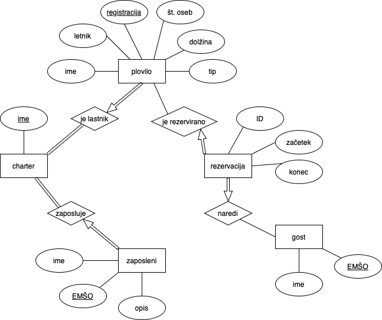

# Marina
Zagon projekta v Binderju: 

Marina je aplikacija namenjena rezervaciji plovil. Preko portala Moja marina, lahko gosti spremljajo tekoče rezervacije in jih po potrebi prekličejo.
Zaposleni v marini, pa lahko preko portala spremljajo rezervacije ter upravljajo plovila in druge zaposlene.

### POV:
Pred vami je Marina. Lokacija je neznana, nekje na otoku, sredi ocena. V marini delujejo 4 charterji, ki skupaj ponujajo 145 plovil. Na voljo imaš naslednje vloge:

**Gost:**
  Tvoja prva naloga je da se registriraš. Rezervacijo lahko narediš le kot prijavljen uporabnik. Nato pa izberi datum, ki ti ustreza in poišči svoje plovilo.
  V portalu Moja marina si lahko ogledaš vse tvoje rezervacije in jih tudi prekličeš, prav tako pa vidiš svoje podatke.

**Zaposlen:**
  Veliko bolj zabavno je biti zaposlen. Prevzemi vlogo enega izmed naslednjih zaposlenih in vstopi v portal Moja marina z vidika zaposlenega. Dostop boš imel do vseh rezervacij, narejenih pri svojem charterju, upravljal boš lahko druge zaposlene, jim dodeljeval uporabniška imena in jih celo odpustil. Seveda s tem pride tudi pravica do zaposlitve. Poleg tega boš lahko upravljal ceno plovil, jh brisal, dodajal...
  Na voljo imaš naslednje profile:
  - **Nika Zupan:**
    - Charter: Euronautic
    - Pozicija: Direktorica
    - Uporabniško ime: nika
    - Geslo: nika
  - **Marko Novak:**
    - Charter: Angelina Yacht Charter
    - Pozicija: Direktor
    - Uporabniško ime: marko
    - Geslo: marko
  - **Ana Kovač:**
    - Charter: Dream Yacht Charter
    - Pozicija: Direktorica
    - Uporabniško ime: ana
    - Geslo: ana
  - **Matija Štajner:**
    - Charter: Pitter Yachtcharter
    - Pozicija: Direktor
    - Uporabniško ime: matija
    - Geslo: matija

## ER diagram

